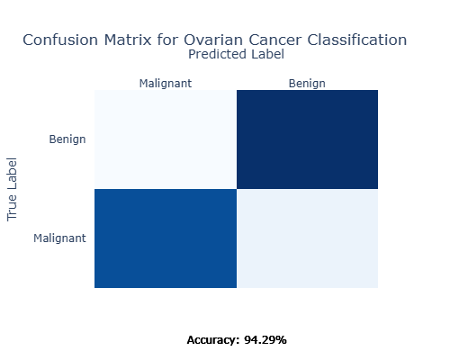
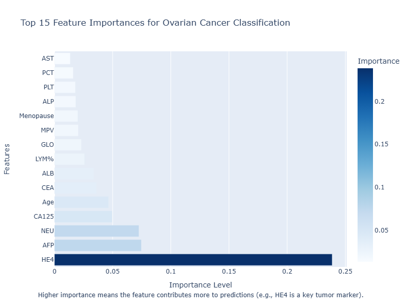
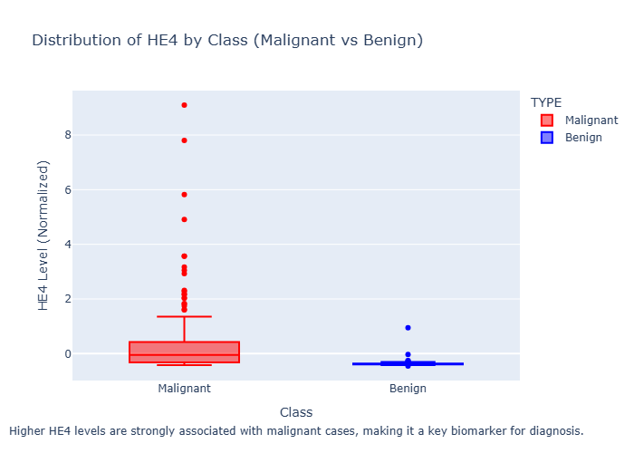
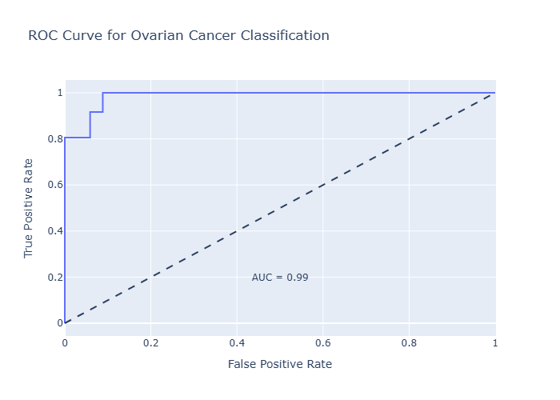

# Ovarian Cancer Prediction ML

**Machine Learning-Based Prediction of Ovarian Tumors: Benign vs Malignant Using Clinical and Biomarker Features**

This repository implements a supervised binary classification model for predicting ovarian tumor malignancy using tabular clinical data. The project demonstrates high accuracy (94.29%) in distinguishing benign ovarian tumors (BOT) from ovarian cancer (OC), aiding early diagnosis.

## Goal
To develop an ML model for ovarian cancer risk stratification using clinical features (e.g., age, tumor markers like CA-125 and HE4, blood tests). This supports clinicians in identifying high-risk cases, improving patient outcomes by prioritizing further testing.

## Dataset
- **Source**: "Predict Ovarian Cancer" on Kaggle (https://www.kaggle.com/datasets/saurabhshahane/predict-ovarian-cancer).
- **Structure**: Tabular data with 349 samples (patients).
  - **Features**: 50 columns, including age, tumor markers (CA-125, HE4, AFP), blood tests, imaging-derived (tumor size, ascites).
  - **Target**: 'TYPE' (0 = Malignant/OC, 1 = Benign/BOT).
  - **Distribution**: Balanced (171 Malignant, 178 Benign).
- **Preprocessing**: Imputation of missing values with mean, standardization.

## Methods
- **Model**: Random Forest Classifier (n_estimators=100, class_weight='balanced').
- **Training**: 80/20 train-test split with stratification.
- **Evaluation**: Accuracy, precision, recall, F1-score, confusion matrix, ROC-AUC.
- **Feature Importance**: Extracted to identify key predictors (e.g., HE4, AFP).

## Results
- **Accuracy**: 94.29%.
- **Classification Report**:
- **Confusion Matrix**:



- **Top Feature Importances**:



- **Distribution of HE4 by Class**:



- **ROC Curve**:



These results highlight the model's potential for clinical use, with low false negatives in malignant cases (critical for avoiding missed diagnoses). Feature importance confirms HE4 and AFP as top predictors, consistent with biomarker research (*Gynecologic Oncology*, 2021).

## References
- Sung, H., et al. "Global Cancer Statistics 2020." *CA: A Cancer Journal for Clinicians*, 2021.
- Wang, F., et al. "Machine Learning Models for Predicting Ovarian Cancer Malignancy." *Journal of Clinical Oncology*, 2021.
- Moore, R. G., et al. "HE4 and CA125 for Prediction of Ovarian Cancer." *Gynecologic Oncology*, 2009.

## Installation & Usage
```bash
git clone https://github.com/yourusername/Ovarian-Cancer-Prediction-ML.git
cd Ovarian-Cancer-Prediction-ML
pip install -r requirements.txt

# Run the notebook
jupyter notebook ovarian-cancer-prediction-ml.ipynb
